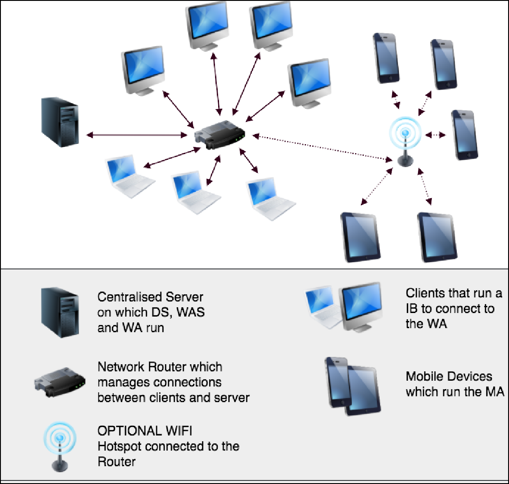
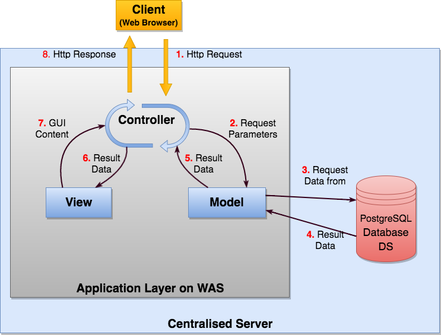
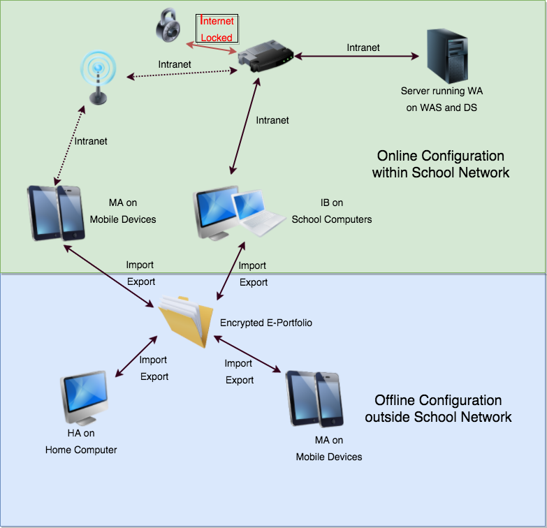
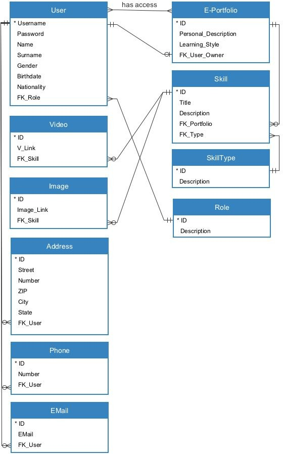
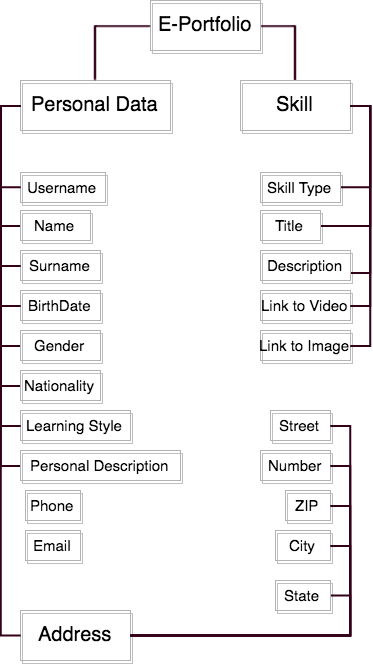
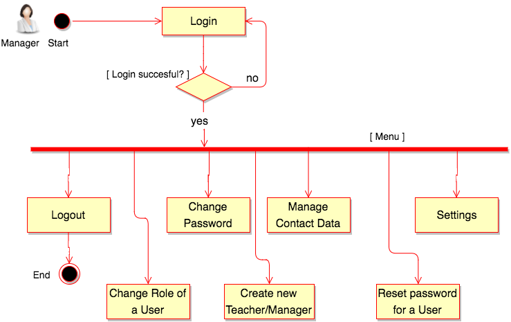
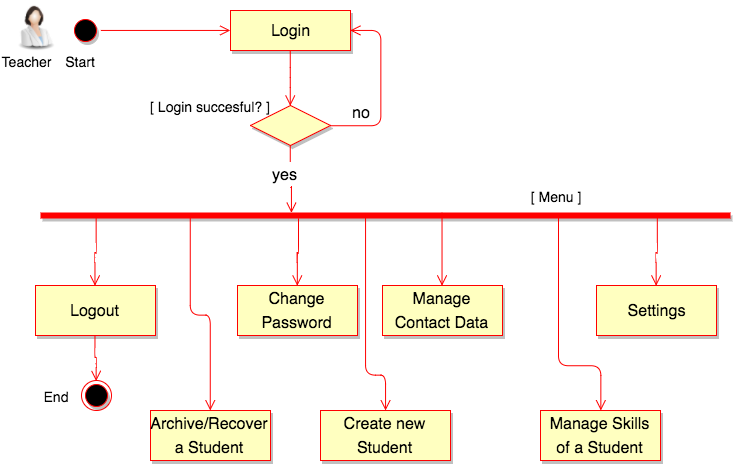
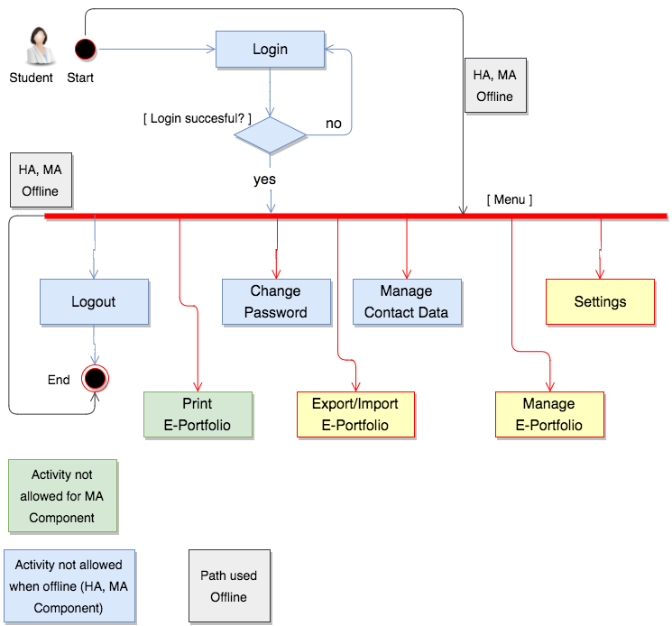

> University of Bolzano
>
> Faculty of Computer Science
>
> Requirements and Design of Software Systems 2016/2017
>
> Prof. Gabriella Dodero
>
> Project
>
> E-CV1217 System
>
> Part 2: Architecture and Design Document (version 2.0)

Date(s): February,4 2017

Prepared by: Heider Jeffer and Marco Pomalo Document status: Proposed

> **Table of Contents**

1.  [Purpose of this Document 3](#purpose-of-this-document)

2.  [Design of E-CV1217 System 3](#design-of-e-cv1217-system)

    1.  [Hardware 3](#hardware)

        1.  [Server 3](#server)

        2.  [Client 4](#client)

            1.  School client and Home client 4

            2.  Mobile Client 4

        3.  [School intranet network 4](#school-intranet-network)

    2.  [Software 5](#software)

        1.  [Server 5](#server-1)

        2.  [Client 5](#client-1)

            1.  School client 5

            2.  Home client 5

            3.  Mobile client 6

    3.  [Database Technology 6](#database-technology)

    4.  [Storage Management 6](#storage-management)

        1.  [WA (Web Application) 6](#wa-web-application)

        2.  [HA (Home Application) 6](#ha-home-application)

        3.  [MA (Mobile Application) 6](#ma-mobile-application)

3.  [From Product Requirements to Design Features
    7](#from-product-requirements-to-design-features)

    1.  [Stakeholders Concerns 7](#stakeholders-concerns)

    2.  [Requirement / Design Association
        7](#requirement-design-association)

4.  [Architecture 9](#architecture)

    1.  [Functionalities 9](#functionalities)

    2.  [Qualities 9](#qualities)

        1.  [Usability 9](#usability)

        2.  [Security 10](#security)

        3.  [Backup 10](#backup)

    3.  [Design and Architecture Patterns
        11](#design-and-architecture-patterns)

        1.  [Design Pattern: Client-Server
            11](#design-pattern-client-server)

        2.  [Architectural Pattern: MVC 12](#architectural-pattern-mvc)

    4.  [General Communication Model 13](#general-communication-model)

    5.  [Data Model 14](#data-model)

        1.  [Database 14](#database)

        2.  [Export Data (XML file) 15](#export-data-xml-file)

5.  [Architectural Views 16](#architectural-views)

    1.  [Physical View 16](#physical-view)

        1.  [HW Component: The Server 16](#hw-component-the-server)

        2.  [HW Component: Computer at School
            16](#hw-component-computer-at-school)

        3.  [HW Component: Mobile Device
            16](#hw-component-mobile-device)

        4.  [HW Component: Computer at Home
            16](#hw-component-computer-at-home)

    2.  [Logical View 16](#logical-view)

        1.  [SW Component: WAS 16](#sw-component-was)

        2.  [SW Component: DS 17](#sw-component-ds)

        3.  [SW Component: WA 17](#sw-component-wa)

        4.  [SW Component: HA 17](#sw-component-ha)

        5.  [SW Component: MA if not connected to school network
            18](#sw-component-ma-if-not-connected-to-school-network)

        6.  [SW Component: MA if connected to the school network
            18](#sw-component-ma-if-connected-to-the-school-network)

        7.  [SW Component: IB 18](#sw-component-ib)

            1.  All Users 18

            2.  Managers 18

            <!-- -->

            2.  Teachers 19

            3.  Students 19

    3.  [Development view 19](#development-view)

    4.  [Process View 19](#process-view)

        1.  [Usertype: Manager 20](#usertype-manager)

        2.  [Usertype: Teacher 20](#usertype-teacher)

        3.  [Usertype: Student 21](#usertype-student)

6.  [Technical choices 21](#technical-choices)

7.  [Glossary 22](#glossary)

# Purpose of this Document

This document will give an overview about a possible design and
implementation of the

E-CV1217 System. The information is based on the Requirements Document
of E-CV1217 System. The topics are described as follows:

❏ The physical layer of architecture. (Hardware)

❏ The logical layer of architecture. (Software)

❏ The chosen Design and Architectural patterns.

❏ The connection between requirements and architecture.

❏ The explanation of the technical choices made.

# Design of E-CV1217 System

This product is composed of five different components:

<table>
<colgroup>
<col style="width: 46%" />
<col style="width: 26%" />
<col style="width: 26%" />
</colgroup>
<thead>
<tr class="header">
<th><blockquote>

<strong>Logical Layer component: (Software)</strong>

</blockquote></th>
<th><blockquote>

<strong>Installed by:</strong>

</blockquote></th>
<th><blockquote>

<strong>Resident on: (Hardware)</strong>

</blockquote></th>
</tr>
</thead>
<tbody>
<tr class="odd">
<td><ol type="1">
<li>
<strong>WAS</strong>: Web Application Server running the web
application <strong>WA</strong>.
</li>
<li>
<strong>DS</strong>: Database Server.
</li>
</ol></td>
<td>System Administrator by using guided installation procedure.</td>
<td>Centralised Server connected to school network.</td>
</tr>
<tr class="even">
<td><blockquote>

3. <strong>IB</strong>: Internet Browser.

</blockquote></td>
<td>No installation required since it is already provided by the
OS.</td>
<td>PC of the school connected to school network.</td>
</tr>
<tr class="odd">
<td><blockquote>

4. <strong>MA</strong>: Mobile Application.

</blockquote></td>
<td>Student by using standard mobile app installation procedure.</td>
<td>Mobile Device optionally connected to school network.</td>
</tr>
<tr class="even">
<td><blockquote>

5. <strong>HA</strong>: Home Application.

</blockquote></td>
<td>Student by using guided self explained installation procedure.</td>
<td>PC at Home.</td>
</tr>
</tbody>
</table>

## Hardware

The Hardware needed for the E-CV1217 System is divided in two parts
because we are talking about a client/server system.

### Server

The WA and the DS will be hosted on the same machine in order to:

- Lower the risk that network traffic can be intercepted.

- Increase performance by working locally and by fully cutting out the
  network.

- Keep the costs low because only one server has to be maintained.

The WAS and the DS will be able to manage peaks of 200 Users accessing
at the same time.

<table>
<colgroup>
<col style="width: 37%" />
<col style="width: 62%" />
</colgroup>
<thead>
<tr class="header">
<th colspan="2"><blockquote>

Server Minimal Hardware Requirements

</blockquote></th>
</tr>
</thead>
<tbody>
<tr class="odd">
<td><blockquote>

HW Component

</blockquote></td>
<td><blockquote>

HW Requested

</blockquote></td>
</tr>
<tr class="even">
<td>CENTRALISED SERVER</td>
<td><ul>
<li>
At least a 3GHz dual core processor
</li>
<li>
At least 8GB of RAM
</li>
<li>
A Gigabit network adapter
</li>
<li>
At least a RAID 5 Data Storage System but a RAID 6 is
recommended. It is able to store at least 10TB of data.
</li>
</ul></td>
</tr>
</tbody>
</table>

### Client

1.  School client and Home client

The Client at school and at home will be a computer. It shall have at
least the minimal hardware requirements suggested from the Operating
System Vendors.

<table>
<colgroup>
<col style="width: 37%" />
<col style="width: 62%" />
</colgroup>
<thead>
<tr class="header">
<th colspan="2"><blockquote>

School Client and Home Client Minimal Hardware Requirements

</blockquote></th>
</tr>
</thead>
<tbody>
<tr class="odd">
<td><blockquote>

HW Component

</blockquote></td>
<td><blockquote>

HW Requested

</blockquote></td>
</tr>
<tr class="even">
<td>SCHOOL CLIENT</td>
<td><ul>
<li>
At least 1.5GHz dual core processor
</li>
<li>
At least 4GB of RAM
</li>
</ul></td>
</tr>
<tr class="odd">
<td>HOME CLIENT</td>
<td><ul>
<li>
At least 40GB of disk space
</li>
<li>
Network adapter for the School client.
</li>
</ul></td>
</tr>
</tbody>
</table>

1.  Mobile Client

<table>
<colgroup>
<col style="width: 37%" />
<col style="width: 62%" />
</colgroup>
<thead>
<tr class="header">
<th colspan="2"><blockquote>

Mobile Client Minimal Hardware Requirements

</blockquote></th>
</tr>
</thead>
<tbody>
<tr class="odd">
<td><blockquote>

HW Component

</blockquote></td>
<td><blockquote>

HW Requested

</blockquote></td>
</tr>
<tr class="even">
<td>MOBILE DEVICE</td>
<td><ul>
<li>
At least the minimal hardware requirements suggested from the
Operating System Vendors.
</li>
</ul></td>
</tr>
</tbody>
</table>

### School intranet network

<table>
<colgroup>
<col style="width: 37%" />
<col style="width: 62%" />
</colgroup>
<thead>
<tr class="header">
<th colspan="2"><blockquote>

Mobile Client Minimal Hardware Requirements

</blockquote></th>
</tr>
</thead>
<tbody>
<tr class="odd">
<td><blockquote>

HW Component

</blockquote></td>
<td><blockquote>

HW Requested

</blockquote></td>
</tr>
<tr class="even">
<td>SCHOOL NETWORK</td>
<td><ul>
<li>
At least a Cat. 5e infrastructure, a Gigabit network is
recommended.
</li>
<li>
Optionally a WIFI Access Point for the access from mobile
devices.
</li>
</ul></td>
</tr>
</tbody>
</table>

## Software

Software needed for the E-CV1217 System is divided in two parts because
we are talking about a client/server system.

### Server

The DS and the WA running on the WAS will be protected from being
accessible from the internet. This measure will be set to grant the
respect of european and national privacy laws regarding underage people.

<table>
<colgroup>
<col style="width: 37%" />
<col style="width: 62%" />
</colgroup>
<thead>
<tr class="header">
<th colspan="2"><blockquote>

Server Minimal Software Requirements

</blockquote></th>
</tr>
</thead>
<tbody>
<tr class="odd">
<td><blockquote>

SW Component

</blockquote></td>
<td><blockquote>

SW Requested

</blockquote></td>
</tr>
<tr class="even">
<td>OS</td>
<td><ul>
<li>
Ubuntu 14 or newer.
</li>
<li>
Windows server 2012 or newer.
</li>
<li>
Mac OSX 10.10.
</li>
</ul></td>
</tr>
<tr class="odd">
<td>DS</td>
<td><ul>
<li>
PostgreSQL Server
</li>
</ul></td>
</tr>
<tr class="even">
<td>WAS</td>
<td><ul>
<li>
Tomcat Server
</li>
</ul></td>
</tr>
</tbody>
</table>

### Client

1.  School client

<table>
<colgroup>
<col style="width: 37%" />
<col style="width: 62%" />
</colgroup>
<thead>
<tr class="header">
<th colspan="2"><blockquote>

School Client Minimal Software Requirements

</blockquote></th>
</tr>
</thead>
<tbody>
<tr class="odd">
<td><blockquote>

SW Component

</blockquote></td>
<td><blockquote>

SW Requested

</blockquote></td>
</tr>
<tr class="even">
<td>OS</td>
<td><ul>
<li>
Ubuntu 14 or newer.
</li>
<li>
Windows 8.1 or newer.
</li>
<li>
Mac OSX 10.10.
</li>
</ul></td>
</tr>
<tr class="odd">
<td>Browser</td>
<td><ul>
<li>
Chrome version 55 or newer.
</li>
<li>
Mozilla Firefox version 48 or newer.
</li>
<li>
Safari version 10.0 or newer.
</li>
</ul></td>
</tr>
</tbody>
</table>

1.  Home client

The HA will be provided as a self explained installation package and can
be installed on the home computer by the student.

<table>
<colgroup>
<col style="width: 37%" />
<col style="width: 62%" />
</colgroup>
<thead>
<tr class="header">
<th colspan="2"><blockquote>

Home Client Minimal Software Requirements

</blockquote></th>
</tr>
</thead>
<tbody>
<tr class="odd">
<td><blockquote>

SW Component

</blockquote></td>
<td><blockquote>

SW Requested

</blockquote></td>
</tr>
<tr class="even">
<td>OS</td>
<td><ul>
<li>
Ubuntu 14 or newer.
</li>
<li>
Windows 8.1 or newer.
</li>
<li>
Mac OSX 10.10.
</li>
</ul></td>
</tr>
</tbody>
</table>

1.  Mobile client

The MA will be obtained from the OS Vendor Application Store.

<table>
<colgroup>
<col style="width: 37%" />
<col style="width: 62%" />
</colgroup>
<thead>
<tr class="header">
<th colspan="2"><blockquote>

Mobile Client Minimal Software Requirements

</blockquote></th>
</tr>
</thead>
<tbody>
<tr class="odd">
<td><blockquote>

SW Component

</blockquote></td>
<td><blockquote>

SW Requested

</blockquote></td>
</tr>
<tr class="even">
<td>OS</td>
<td><ul>
<li>
iOS 8 or newer.
</li>
<li>
Android 5.0 or newer.
</li>
<li>
Windows 10 Mobile.
</li>
</ul></td>
</tr>
</tbody>
</table>

## Database Technology

This Section describes the Type of Database used in the System.

In order to manage different users in a network, we need a Database to
store their data. The management of user access rights is crucial to
ensure that the right user accesses only to the right data. The
implementation of the connection to the Database will be done by using
PHP 5 which is well known and experienced by developers. The queries
will be written by using prepared statements which prevent some security
issues such as query injection.

The Database is Relational SQL-Based which allows a good balance between
Integrity and Availability. The textual data of E-Portfolios are stored
in this Database. The links to Images and Videos are stored as well as
textual data in the Database.

## Storage Management

This\`Section describes the Storage Management the system needs. We have
different storage management for the components of the System.

### WA (Web Application)

The Images and Videos of E-portfolios are stored as compressed files in
dedicated folders on the server storage. The links to these files are
stored as in Section 2.3

### HA (Home Application)

The installation process will ask the student in which folder she/he
wants to store the

E-Portfolio. Images, Videos and an XML file that contains the textual
data will be stored in the above folder. The links to Images and Videos
are stored in the XML file as well.

### MA (Mobile Application)

The Images and Videos of the E-Portfolio are stored as compressed files
in the dedicated folder on the device memory. The textual data of the
E-Portfolio are stored as XML file in the same folder. The links to
Images and Videos are stored in the XML file as well.

# From Product Requirements to Design Features

## Stakeholders Concerns

Customers (Department of Education of South Tyrol):

- Is the system cheap to implement?

- Does the system need additional infrastructure (expenses)?

- Does the system respect legal and privacy laws? User group: Students
  and Teachers:

- Is the system available?

- Is my data safe?

- Who can access my data?

- What happens if I lose my password? User group: Managers

- Is the system available?

- Who can reset my password?

- Is the data secure? System Administrators:

- Is the system available?

- Is the system secure?

- Is the backup done as requested? Educators:

- Is the data safe stored?

- Is the system secure?

- Is the E-Portfolio well formatted?

- Does the system respect legal and privacy laws? Parents:

- Is the data safe stored?

- Is the system secure?

- Does the system respect legal and privacy laws? Companies:

- Is the E-Portfolio readable?

- Does the E-Portfolio contain relevant information?

## Requirement / Design Association

This Section describes in a schematic simplified way the connection
between the Tasks of the Requirement Document and the corresponding
Architecture elements. Specific Requirements of the Requirements
Document are omitted here if related to a main task.

Implicit Software Components are described in Section 5.2 and omitted
here.

<table>
<colgroup>
<col style="width: 50%" />
<col style="width: 50%" />
</colgroup>
<thead>
<tr class="header">
<th><strong>Task</strong></th>
<th><strong>Design Element</strong></th>
</tr>
</thead>
<tbody>
<tr class="odd">
<td>RISx.x Initialisation of the System</td>
<td>
<strong>SWC1.1</strong> Installer

<strong>SWC2.1</strong> Installer
</td>
</tr>
</tbody>
</table>

<table>
<colgroup>
<col style="width: 50%" />
<col style="width: 50%" />
</colgroup>
<thead>
<tr class="header">
<th></th>
<th><strong>SWC3.1</strong> Installer</th>
</tr>
</thead>
<tbody>
<tr class="odd">
<td>TG1.1 Login/Logout</td>
<td>
<strong>SWC7.1</strong> Login

<strong>SWC6.1</strong> Login (Students only)
</td>
</tr>
<tr class="even">
<td>TG2.1 Change Password.</td>
<td><strong>SWC7.2</strong> Password Changer</td>
</tr>
<tr class="odd">
<td>TM1.1 Password Lost.</td>
<td><strong>SWC7.6</strong> Password Recovery</td>
</tr>
<tr class="even">
<td>TM2.1 Create New Teacher or Manager In The System</td>
<td><strong>SWC7.5</strong> Teacher or Manager Creator</td>
</tr>
<tr class="odd">
<td>TM3.1 Change Role of Teachers and Managers.</td>
<td><strong>SWC7.7</strong> Role Changer</td>
</tr>
<tr class="even">
<td>TT1.1 Create New Student In The System</td>
<td><strong>SWC7.8</strong> Student Creator</td>
</tr>
<tr class="odd">
<td>TT2.1 Archive Student In The System</td>
<td><strong>SWC7.9</strong> Student Achiever</td>
</tr>
<tr class="even">
<td>TT2.2 Recover Archived Student From The System</td>
<td><strong>SWC7.9</strong> Student Achiever</td>
</tr>
<tr class="odd">
<td>TT3.1 Create/Update/Delete Skill for specific Student.</td>
<td><strong>SWC7.10</strong> Skill Editor</td>
</tr>
<tr class="even">
<td>TG3.1 Create/Update/Delete Contact Data</td>
<td><strong>SWC4.5</strong> E-Portfolio Editor (Students only)
<strong>SWC5.4</strong> E-Portfolio Editor (Students only)
<strong>SWC7.3</strong> Contact Data Manager</td>
</tr>
<tr class="odd">
<td>TS1.1 Manage Personal Description</td>
<td><strong>SWC4.5</strong> E-Portfolio Editor <strong>SWC5.4</strong>
E-Portfolio Editor <strong>SWC7.14</strong> E-Portfolio Editor</td>
</tr>
<tr class="even">
<td>TS2.1 Create New Skill.</td>
<td><strong>SWC4.5</strong> E-Portfolio Editor <strong>SWC5.4</strong>
E-Portfolio Editor <strong>SWC7.14</strong> E-Portfolio Editor</td>
</tr>
<tr class="odd">
<td>TS2.2 Read Skills</td>
<td><strong>SWC4.5</strong> E-Portfolio Editor <strong>SWC5.4</strong>
E-Portfolio Editor <strong>SWC7.14</strong> E-Portfolio Editor</td>
</tr>
<tr class="even">
<td>TS2.3 Update Skill.</td>
<td><strong>SWC4.5</strong> E-Portfolio Editor <strong>SWC5.4</strong>
E-Portfolio Editor <strong>SWC7.14</strong> E-Portfolio Editor</td>
</tr>
<tr class="odd">
<td>TS2.4 Delete Skill.</td>
<td><strong>SWC4.5</strong> E-Portfolio Editor <strong>SWC5.4</strong>
E-Portfolio Editor <strong>SWC7.14</strong> E-Portfolio Editor</td>
</tr>
</tbody>
</table>

<table>
<colgroup>
<col style="width: 50%" />
<col style="width: 50%" />
</colgroup>
<thead>
<tr class="header">
<th>TS7.1 Export E-Portfolio</th>
<th><strong>SWC4.2</strong> Export <strong>SWC5.2</strong> Export
<strong>SWC7.11</strong> Export</th>
</tr>
</thead>
<tbody>
<tr class="odd">
<td>TS7.2 Import E-Portfolio</td>
<td><strong>SWC4.3</strong> Export <strong>SWC5.3</strong> Import
<strong>SWC7.12</strong> Import</td>
</tr>
<tr class="even">
<td>TS8.1 Print E-Portfolio</td>
<td>
<strong>SWC4.4</strong> Print E-Portfolio

<strong>SWC7.13</strong> Print E-Portfolio
</td>
</tr>
<tr class="odd">
<td>TS9.1 Manage Learning Style Information</td>
<td><strong>SWC4.5</strong> E-Portfolio Editor <strong>SWC5.4</strong>
E-Portfolio Editor <strong>SWC7.14</strong> E-Portfolio Editor</td>
</tr>
</tbody>
</table>

# Architecture

This Section describes the main features and qualities of the E-CV1217
System.

## Functionalities

The main functionalities available for WA, HA, MA Components of the
system will be:

- Manage Personal Description.

- Manage Learning Style Information.

- Create/Update/Delete Contact Data.

- Create New Skill.

- Update Skill.

- Delete Skill.

- Read Skills.

- Export E-Portfolio.

- Import E-Portfolio.

- Print E-Portfolio on paper or as PDF.

## Qualities

### Usability

Usability is very important for our target main users which are underage
students. They use to be annoyed very fast. To avoid this, the commands
will be represented as animated icons showing in a schematic way what
the icon is for. Tooltips that explain clearly what the icon is for will
be also provided. This kind of approach shall make the recognition of
the functionalities easier.

The MA Component will be implemented following the specific usability
patterns for mobile applications in order to grant a good user
experience.

The Managers of the school provide help and support for specific
questions about howtos.

### Security

The european and national laws about privacy for underage people are
very strict. It is then very important to secure the data access of the
system.

The central server at school will be not accessible from the Internet.
Intranet communication will be allowed only. The PgCrypto function of
PostgreSQL on DS Component allow to encrypt the content of the Database
with AES-256 encryption. The WA will apply the same AES-256 encryption
to the part of the E-Portfolio stored in folders on the centralised
server. The MA Component will use the encoding system for mobile data
that is embedded in mobile OS.

The HA Component will use the same AES-256 encryption applied to folders
as the WA. The IB Component will clean cached data after quitting in
order to remove locally stored temporary data.

The Export/Import of an E-Portfolio will be encrypted with AES-256 and
password protected as requested in Tasks TS7.1 and TS7.2 of the
Requirement Document. The from the student password protected exported
E-Portfolio will be protected in case of loss or in the case others try
to tamper the found E-Portfolio. All these operations except the request
for an encryption/decryption password are transparent to the user.

A distributed version control system (git like) will be implemented on
WA, HA, MA Components to ensure correct data synchronisation. The git
like data will be included in the exported E-Portfolio. In the case of
synchronisation conflicts, the student will be asked which version
she/he intend to keep.

### Backup

The centralised server will backup the system once a day with weekly
rotation. One backup of every week shall be kept for four weeks.

## Design and Architecture Patterns

### Design Pattern: Client-Server

This Section describes the client-server design pattern which is used in
the school. A client/server system “is a must” in environments in which
many users have access to the same resources at the same time. The
Server “serves” literally the Clients. This pattern is ideal in our
school environment in which we have many clients accessing the same
resource at the same time, but performing individual different actions.
The Server accepts requests from any Client connected and respond to
every individual request taking care from whom the request did come
from.

The image below describes the design pattern client-server applied to
E-CV1217 System.

### Architectural Pattern: MVC

This Section describes the architectural pattern MVC.

MVC stands for Model, View, Controller. It consists of three individual
layers that can be changed singularly without affecting the other
layers. The Model is the data, the Controller is the manager that
handles the Model and the View. The View is what is presented to the
user.

Changing the user interface (View) with a new one does not affect the
manager (controller) and the data (Model). This concept gives a huge
advantage in flexibility and modularity.

The image below describes the typical data flow in the E-CV1217 System.

For example, the user enters the login credentials in the IB login page
(View). The credentials are sent to the Controller which gather the data
from the Model which query the Database. Some business logic may be
executed. The Controller populate the right page (View) with the
gathered data (Model) and send the populated page back to the IB. The
user see the answer on her/his request.

## General Communication Model

This Section describes the communication between the different
Components of the E-CV1217 System.

The image above shows the communication path in the online version and
in the offline version of E-CV1217 System. Within the school network the
user can login and perform all the operation on E-Portfolio online. To
work outside the school network the student has to export the
E-Portfolio within the school network and import it at home or on
her/his mobile device. The E-Portfolio must be exported again and
imported within the school network to update and synchronise the data
resident on the server.

## Data Model

This Section describes the how data will be stored. The textual data
will be stored in the Database and the images and videos as file in
specific folders.

### Database

The image below describes the simplified Database structure used to
store textual data.

### Export Data (XML file)

The image below shows the schematic E-Portfolio data in a tree like XML
structure.

# Architectural Views

## Physical View

This Section describes the E-CV1217 System from the hardware point of
view. It describes the hardware components and their
relations/interactions.

The graphical explanation is the same of Section 4.3 and Section 4.4.

### HW Component: The Server

- Purpose: Manage and store user’s data and E-Portfolios.

- Application: DS, WAS, WA

- Type of Device: Server.

- Requirements:

  - Connected to school network.

  - Allow the DS, WAS, WA to run and provide functionalities.

### HW Component: Computer at School

- Purpose: Allow to connect to the server and to use server
  functionalities.

- Application: IB

- Type of Device: Desktop computer or Laptop.

- Requirements:

  - Connected to school network.

### HW Component: Mobile Device

- Purpose:

  - Allow Students only to connect to the server and to use server
    functionalities within school network.

  - Allow to manage, import/export an E-Portfolio.

- Application: MA

- Type of Device: Tablet or Smartphone.

### HW Component: Computer at Home

- Purpose:

  - Allow Students only to to manage, import/export an E-Portfolio.

- Application: HA

- Type of Device: Desktop computer or Laptop.

## Logical View

This Section describes the E-CV1217 System from the software point of
view. It describes the software components and their
relations/interactions.

### SW Component: WAS

> **SWC1.1** Installer

- Guide the user through the installation.

> **SWC1.2** Tomcat Server

- Allow the WA to run.

- Check incoming connections and manage dataflow to/from WA.

- Allow the WA to be accessible from the school network.

### SW Component: DS

> **SWC2.1** Installer

- Guide the user through the installation.

> **SWC2.2** PostgreSQL Server

- Store user data and their credentials.

- Store textual part of E-Portfolios.

- Allow the DS to be accessible from the WA.

### SW Component: WA

> **SWC3.1** Installer

- Guide the user through the installation.

> **SWC3.2** DS Interface

- Allow to connect to the DS.

- Is the intermediary between DS and IB.

- Is the intermediary between DS and MA if connected to school network.

- Enables access from IB and from MA if connected to school network, to
  E-Portfolios.

- Triggers encoding/decoding when needed or after timeout of 30 minutes.

> **SWC3.3** Encoder (AES-256)

- Encode the images and videos on the server.

- Triggers the Encoding of the DS.

- Encode the exported E-Portfolio.

> **SWC3.4** Decoder (AES-256)

- Decode the images and videos on the server

- Triggers the Decoding of the DS.

- Decode the exported E-Portfolio.

### SW Component: HA

> **SWC4.1** Installation

- Guide the user through a self explained installation.

> **SWC4.2** Export

- Encode and export the E-Portfolio to a compressed file.

> **SWC4.3** Import

- Decode and import the E-Portfolio from a compressed file.

> **SWC4.4** Print E-Portfolio

- Print E-Portfolio to a printer or to a PDF file.

> **SWC4.5** E-Portfolio Editor

- Create, Edit, Delete Skills.

- Manage Personal Description.

- Manage Learning Style Information.

- Manage Contact Data.

> **SWC4.6** Settings

- Allow to set the language.

### SW Component: MA if not connected to school network

> **SWC5.1** Installer

- Guide the user through the installation.

> **SWC5.2** Export

- Encode and export the E-Portfolio to a compressed file.

> **SWC5.3** Import

- Decode and import the E-Portfolio from a compressed file.

> **SWC5.4** E-Portfolio Editor

- Create, Edit, Delete Skills.

- Manage Personal Description.

- Manage Learning Style Information.

- Manage Contact Data.

> **SWC5.5** Settings

- Allow to set the language.

### SW Component: MA if connected to the school network

Following Software Components are in addition to the SWC5.x.

> **SWC6.1** Login

- Login with the personal credentials.

### SW Component: IB

The Software Components of this Section are intended to be viewed and
managed in the Component IB but they are implemented in the WA
Component. This distinction is made to clarify which Software Components
interacts with the user (IB) and which not (WA).

This component is used by different types of users.

1.  All Users

> **SWC7.1** Login

- Login with the personal credentials.

> **SWC7.2** Password Changer

- Allow a user to change the own password.

> **SWC7.3** Contact Data Manager

- Allow a user to Create, Edit, Delete contact data.

> **SWC7.4** Settings

- Allow to set the language.

2.  Managers

> **SWC7.5** Teacher or Manager Creator

- Allow to create a new Teacher or Manager in the system.

> **SWC7.6** Password Recovery

- Allow a Manager to reset password for a user.

> **SWC7.7** Role Changer

- Allow a Manager to promote a Teacher to Manager or to downgrade a
  Manager to a Teacher.

2.  Teachers

> **SWC7.8** Student Creator

- Allow to create a new Student in the system.

> **SWC7.9** Student Achiever

- Allow to archive and recover again a Student in the system.

> **SWC7.10** Skill Editor

- Allow to Create, Edit, Delete a skill of a specific Student.

3.  Students

> **SWC7.11** Export

- Encode and export the E-Portfolio to a compressed file.

> **SWC7.12** Import

- Decode and import the E-Portfolio from a compressed file.

> **SWC7.13** Print E-Portfolio

- Print E-Portfolio to a printer or to a PDF file.

> **SWC7.14** E-Portfolio Editor

- Create, Edit, Delete Skills.

- Manage Personal Description.

- Manage Learning Style Information.

## Development view

This Section describes the System from the Developer’s point of view.

The E-CV1217 System is implemented following the MVC Architectural
Pattern. The Section

4.3.2 describes this pattern applied to this system.

## Process View

This Section describes and shows the workflow of the users of E-CV1217
System. The workflow is described for each type of User.

### Usertype: Manager

### Usertype: Teacher

### Usertype: Student

# Technical choices

- Privacy

  - All the technical choices are made according to the european and
    national privacy law regarding underage people. This is one of the
    major keypoint of this product.

- Database

  - The PostgreSQL Database ensures high security because it is able to
    manage encryption of data.

- Web Application

  - A Web application gives many advantages:

    - The client only needs an internet browser installed and a network
      connection.This is one of the cheapest solutions for a client.

    - The Server can run the web application and the database together,
      so only one server is needed. It is very easy to transfer the
      database to another server if needed in the future.

- MVC Pattern

  - The three layers of MVC allow to perform following example actions
    on one layer without affecting the other two layers:

    - Change or improve the GUI to enhance usability.

    - Change the Database Server if it is needed.

    - Change the Encryption Algorithm.

- Mobile Application

  - Smartphones and Tablets are very popular under teenagers. A part of
    their life is on the mobile device, so the decision to embed a
    mobile application in the system. The responsive design is not
    really usable for all the mobile devices, we decided for a native
    application that can work online when connected to the school
    network and offline when not. This allow to update the E-Portfolio
    directly on the Server when at school. Outside the school network
    the application work offline in the same way of the standalone
    application that can be installed on the home computer.

# Glossary

| **Distributed Version Control** | Allows to keep temporal track of any data modification in order to synchronise different versions of the same data. |
|---------------------------------|---------------------------------------------------------------------------------------------------------------------|
| **DS**                          | Database Server                                                                                                     |
| **HA**                          | Home Application: the application that can be installed at home.                                                    |
| **HW**                          | Hardware                                                                                                            |
| **IB**                          | Internet Browser: application that allow to use navigate into Internet.                                             |
| **MA**                          | Mobile Application: the application that can be installed on a mobile device.                                       |
| **OS**                          | Operating System.                                                                                                   |
| **SW**                          | Software                                                                                                            |
| **SWCx.x**                      | Software Component                                                                                                  |
| **WA**                          | Web Application: the application can be accessed via an IB.                                                         |
| **WAS**                         | Web Application Server.                                                                                             |
