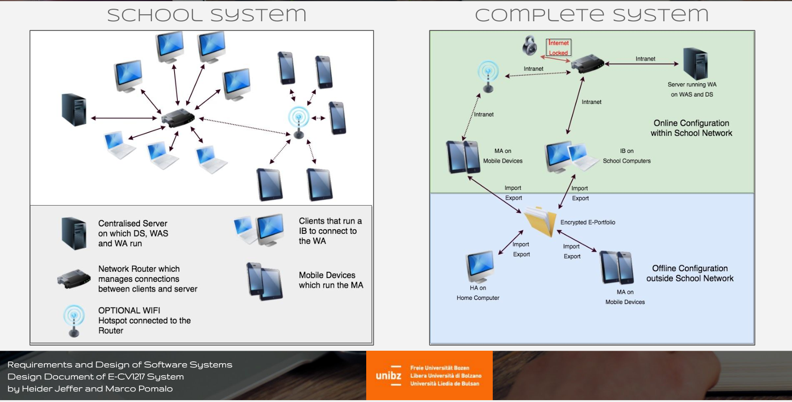
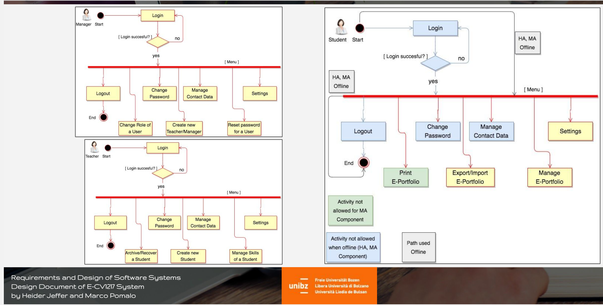
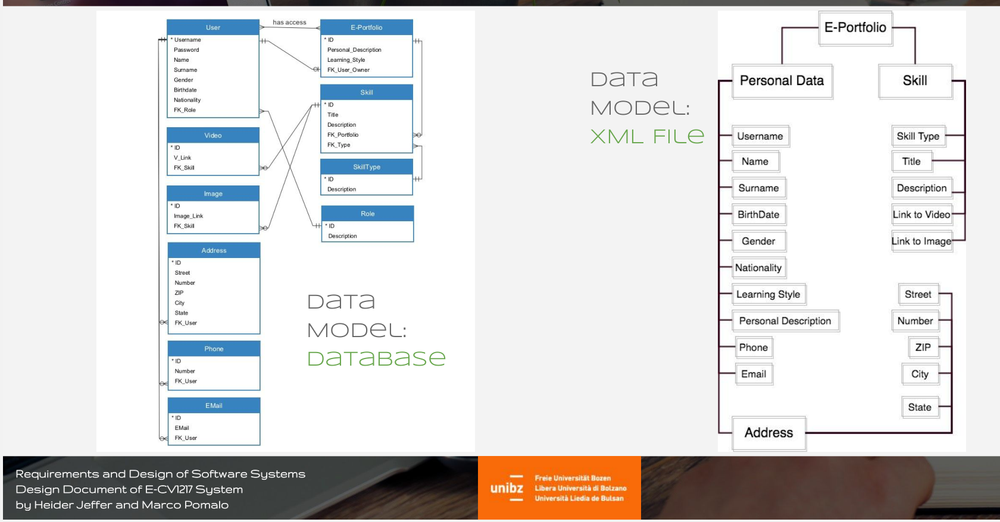
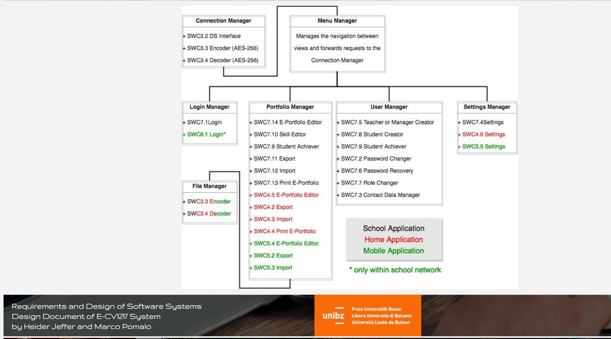
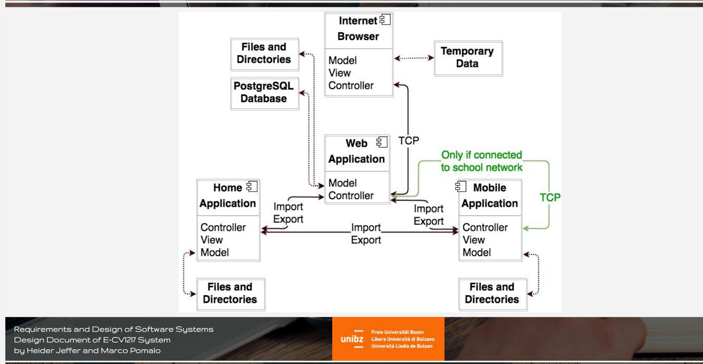

# Requirements and Design of Software Systems
* University of Bolzano | Faculty of Computer Science
* Requirements and Design of Software
* Prof. Gabriella Dodero
* Project: E-CV1217 System: An Electronic Portfolio (Curriculum Vitae) for Teenagers
* Prepared by: Heider Jeffer and Marco Pomalo

## Part 1: Requirements Document (version 2.0)
* Link: https://github.com/HeiderJeffer/Requirements-and-Design-of-Software-Systems/blob/main/RequirementsDocument.pdf
* Date(s): January,24 2017
* Prepared by: Heider Jeffer and Marco Pomalo
* Document status: Proposed

## Part 2: Architecture and Design Document (version 2.0)
* Link: https://github.com/HeiderJeffer/Requirements-and-Design-of-Software-Systems/blob/main/DesignDocument.pdf
* Date(s): February,4 2017
* Prepared by: Heider Jeffer and Marco Pomalo
* Document status: Proposed

# Introduction and Scope
- Especially thought for school dropouts
(European Project for School Dropouts).

- Based on the requirements document.

- System consist of 5 different Components:
	- Web Application Server + Database Server
	- Web Application
	- Internet Browser
	- Home Application
	- Mobile Application
	
# Quality Requirements: Security
- The data are protected against unauthorized access.
- Database and Files are encrypted with AES-256.
- The access to the Server from the Internet is denied.
- The Home Application works only offline.
- The Mobile Application can work offline and even online only if connected to the school network.

# Quality Requirements: Usability
- Animated icons showing the purpose of the command.
- Tooltips.
- Specific usability patterns especially for the Mobile Application.
- Recognition before Recall principle.

# Views
- Design and Architectural Patterns.
	- Client/Server
	- MVC (Model View Controller)

- Models and Diagrams:
	- Physical view       	- Hw Components Diagram
	- Process View       		- Process Diagram
	- Logical view     		- Data Models, Class Diag.
	- Development View  		- Components Diagram
	
## Views: Physical View

## Views: Process View

## Views: Logical View

## Views: Development View

